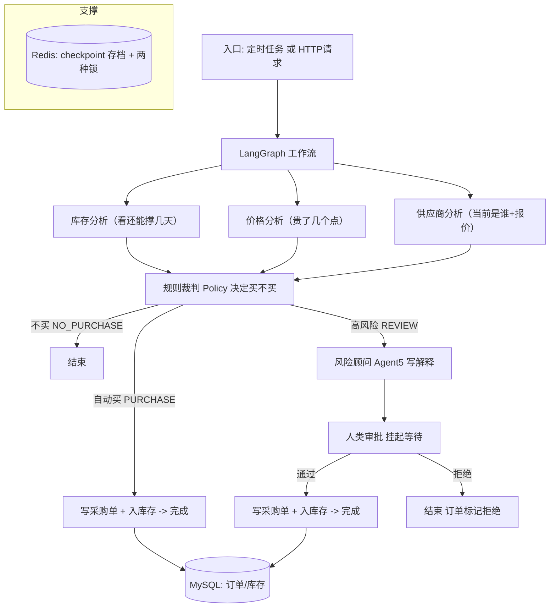

# 项目地图 · Project Map

> 这份文档回答一个问题：**用户按下一次采购到底经历了哪些环节？**
> 先把“一层层怎么串起来”看懂，再谈某个函数叫什么。

---

## 一、谁启动这件事？

这个系统有**两条入口**会触发“分析要不要采购”的流程：

1. **定时自动巡视（Auto Procurement）**
   - 每天巡检所有食材，只要 `当前库存 < 日销量 × 3（3 天需求）` 就进流程。
   - 常见由“快进时间”的服务触发（`app/services/time_simulation.py` → `auto_procurement.scan_and_trigger_procurement`）。
   - 真实代码文件：`app/services/auto_procurement.py`。

2. **收到 HTTP 请求（例如用户手动问：帮我买“面粉”）**
   - 由 FastAPI 提供的一个接口触发同一套图。
   - 真实代码文件：`app/api/purchase.py`（`POST /api/v1/purchase`）。

> 两种入口最后都调同一个 **LangGraph 工作流**，也就是后面画出的这套分析流水线。

---

## 二、整张地图

---

## 三、逐层说明（全部是人话）

### 层 1：FastAPI / Service — 大门和门卫
- 负责“接请求”、解析参数、读写数据库、最后真正改库存。
- **不是打怪智能的一部分**，是普通后端的“干活肌肉”。
- 参考文件：`app/api/*`（HTTP 入口）、`app/services/*`（自动巡检、审批自动放行、入库执行）。

### 层 2：LangGraph — 流程控制器
- 决定“谁先干活、谁能一起干、干完给谁、要不要暂停等人”。
- 参考文件：`app/graph/workflow.py`（接线）+ `app/graph/nodes.py`（每个岗位上的人）+ `app/graph/state.py`（所有人共用的工作表）。

### 层 3：三个确定性分析（Python，不喊大模型）
- 它们并行（三个同时算），各自只做“算术/照抄”。
- 因为互不依赖，可以一起跑——这就是 `Fan-out`。跑完要不要买由一个 `Policy` 收口，叫 `Fan-in`。

### 层 4：rule-ish 裁判 `deterministic_policy`
- 用一套写死的规则决定三种结局：`NO_PURCHASE`（不买）、`PURCHASE`（自动买）、`REVIEW`（要给人审）。
- 它会被并行三分析喂数据，也会兜底读输入里的顶层字段，缺了也能算。

### 层 5：风险顾问 Agent 5（LLM）
- 只在 REVIEW 登场。它不决策采购，只把风险讲给人听。
- 参考：`nodes.py` 里的 `agent5_node`。

### 层 6：人类审批（HITL）
- 走到这一步，工作流会真的“暂停”（`interrupt`），等端到端之后再回来（`Command resume`）。
- 通过 ⇒ 继续走采购；拒绝 ⇒ 结束。

### 层 7：真正落单入库（Service + MySQL + Redis Lock）
- `execute_inbound_stock()` 把数量写进 `purchase_order_items`，库存 `inventory.current_stock` +N，订单标 `COMPLETED`，全程一个数据库事务、且有幂等，避免多算一次。

---

## 四、数据的两个“家园”别搞混

| 名字 | 是什么 | 存哪 |
| --- | --- | --- |
| `policy_decision.quantity` | “这次规则认为该买多少” | 内存 Graph State（本次流程中） |
| `purchase_order_items.quantity` | “真正写进订单的数量” | MySQL |
| `inventory.current_stock` | “数据库里真实的当前库存” | MySQL |

> Rec）记忆：
> 决策的“该买 20”并不等于已经买 20；只有到了 MySQL 的 `order_item` 并且执行入库后才会真的多 20。

详见 `docs/mysql-explained.md`。

---

## 五、快速默背一句

**入口 → (并行三分析) → 固定规则裁判 → [普通就自动补 / 高风险就 Agent5写报告 → 人审] → Service 真正入库存 → MySQL 存档。**
